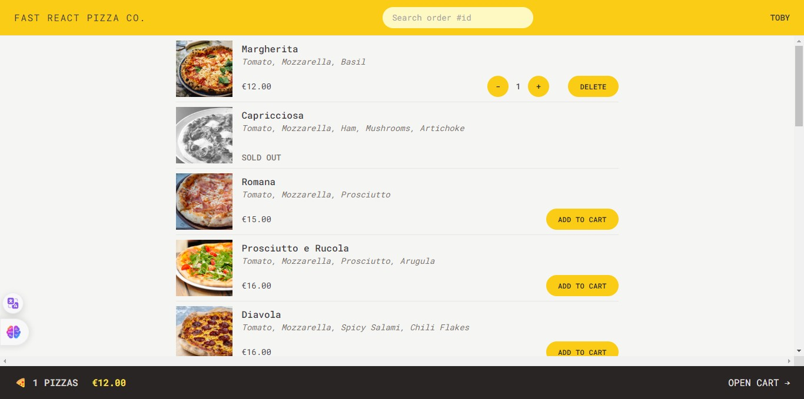

## ✨Project preview

<h1 align=center>🍕 FAST REACT PIZZA CO.</h1>

<h3 align="center">
  Build Using:
  
  
</h3>

 

#### 📚 Course project

- The Ultimate React Course 2023: React, Redux & More, by Jonas Schmedtmann.

 

🌐The online site: <a href="" target="_blank">🍕 FAST REACT PIZZA CO.</a>

 

##

 

# React + Vite

This template provides a minimal setup to get React working in Vite with HMR and some ESLint rules.

Currently, two official plugins are available:

- [@vitejs/plugin-react](https://github.com/vitejs/vite-plugin-react/blob/main/packages/plugin-react/README.md) uses [Babel](https://babeljs.io/) for Fast Refresh
- [@vitejs/plugin-react-swc](https://github.com/vitejs/vite-plugin-react-swc) uses [SWC](https://swc.rs/) for Fast Refresh
